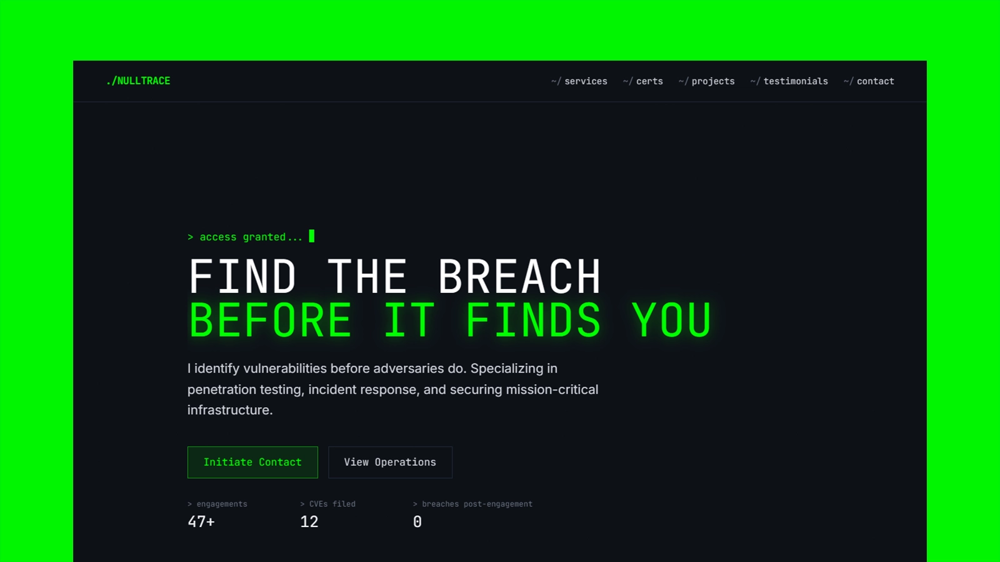

# NULLTRACE - Astro Security Consultant Theme

[](https://nulltrace-two.vercel.app/)

[](https://astro.build/)
[](https://tailwindcss.com/)
[](https://www.typescriptlang.org/)
[](./LICENSE)

**Preview:** [nulltrace-two.vercel.app](https://nulltrace-two.vercel.app/)

NULLTRACE is a dark, terminal-inspired Astro theme for security consultants, penetration testers, incident response specialists, and boutique cybersecurity studios.

It is built as a single-page landing portfolio with strong technical atmosphere, accessible navigation, crawlable content, and production-ready SEO defaults.

## Features

- Terminal-inspired landing page for cybersecurity professionals
- Responsive fixed header with full-screen mobile menu
- Hero section with animated terminal typewriter sequence and clear CTAs
- Hero social-proof row with animated terminal-style impact counters
- Services section for penetration testing, incident response, auditing, and infrastructure security
- Methodology timeline for explaining engagement flow
- Certification audit log for client trust signals
- Project/case-study highlights
- Contact form shell ready to connect to your preferred backend
- Accessible skip link, focus states, landmarks, labels, and reduced-motion fallbacks
- Server-rendered Astro output for better SEO and no-JS readability
- Open Graph, Twitter, canonical, robots, theme color, and JSON-LD structured data defaults
- Tailwind CSS 4 styling through the Vite plugin
- Native Astro components with self-hosted, subset Google Material Symbols icons

## Tech Stack

- Astro 6
- TypeScript configuration for type-checking
- Tailwind CSS 4

## Getting Started

Install dependencies:

```bash
npm install
```

Start the local development server:

```bash
npm run dev
```

Build for production:

```bash
npm run build
```

Preview the production build locally:

```bash
npm run preview
```

Type-check the project:

```bash
npm run lint
```

## Theme Setup

Before publishing, update the project-specific values:

- `site` in `astro.config.mjs`
- Brand, SEO metadata, JSON-LD values, navigation, hero copy, contact details, social links, services, methodology, tool inventory, projects, and footer text in `src/config/site.ts`
- Canonical behavior in `src/pages/index.astro`
- Icon names in `src/config/site.ts`
- Contact form handling in the contact section
- `public/favicon.svg` if you want a custom brand mark

The current placeholder production URL is:

```txt
https://nulltrace-two.vercel.app
```

Replace it with your real deployment domain before publishing.

## SEO

The theme includes:

- Server-rendered page content
- Canonical URL
- Meta title and description
- Keyword meta
- Robots meta
- Open Graph tags
- Twitter card tags
- JSON-LD structured data for a professional service
- Theme color
- SVG favicon
- No-JS visibility fallback for animated content

Main SEO files:

- `src/pages/index.astro`
- `astro.config.mjs`
- `public/favicon.svg`

## Accessibility

The theme includes:

- Semantic `header`, `main`, `section`, `article`, `footer`, and labelled navigation
- Skip link for keyboard users
- Visible focus rings
- Mobile menu semantics with `aria-expanded`, `aria-controls`, and Escape-to-close behavior
- Body scroll lock while the mobile menu is open
- Labelled contact form fields with autocomplete and required states
- Decorative UI elements marked with `aria-hidden`
- Reduced-motion CSS support
- No-JS fallback so animated SSR content remains visible

## Content Notes

The included copy is starter/demo content. Replace it with real services, project summaries, tools, contact details, and social profiles before publishing.

The contact form is a theme shell and does not submit anywhere yet. Connect it to your preferred form provider, server action, or API endpoint.

## Project Structure

```txt
src/
  App.astro
  index.css
  config/
    site.ts
  pages/
    index.astro
  components/
    Certifications.astro
    MaterialIcon.astro
    Methodology.astro
    Testimonials.astro
    Toolstack.astro
public/
  favicon.svg
  preview.webp
  fonts/
    material-symbols-outlined-200.ttf
```

## Changelog

See [CHANGELOG.md](CHANGELOG.md) for release notes.

## Publishing Checklist

- Replace `https://nulltrace-two.vercel.app` with your real domain if you fork the theme
- Replace `hello@nulltrace.security` in `src/config/site.ts`
- Replace GitHub and LinkedIn placeholder URLs
- Connect or remove the contact form
- Update demo projects and services
- Update demo certification entries
- Update anonymized testimonials
- Update structured data to match the real business/person
- Run `npm run lint`
- Run `npm run build`
- Run `npm audit --omit=dev`

## License

This project is licensed under the MIT License. See [LICENSE](LICENSE).
