# AI Vulnerability Scanner

The rapid integration of Large Language Models (LLMs) into production environments introduces critical attack vectors, including Prompt Injection, Data Exfiltration, and RBAC bypasses. To prevent insecure AI configurations from reaching production, this project implements a two-phase, automated DevSecOps gatekeeper embedded directly into the CI/CD pipeline.

Orchestrated via **LangGraph**, this Dockerized engine evaluates developer-committed prompts and actively attacks staging endpoints before allowing code to merge.

<button id="btn-phase1" class="tab-btn active" onclick="switchTab(event, 'phase1')">Phase 1: Static</button>
<button id="btn-phase2" class="tab-btn" onclick="switchTab(event, 'phase2')">Phase 2: Dynamic</button>

<h2>The Gatekeeper: Static Code Analysis</h2>

When a developer opens a Pull Request on GitHub, a <strong>GitHub Actions</strong> runner instantly triggers the first stage of the LangGraph state machine. This phase is designed to catch structurally toxic configurations before spinning up expensive staging environments.

The scanner mounts the developer's <code>prompts.yaml</code> file into a lightweight container and evaluates the raw system instructions using a dual-layered approach:

<ul>
<li><strong>Lexical Heuristics (TF-IDF):</strong> A blazing-fast baseline check that identifies dangerously exposed endpoints (e.g., <code>/api/payroll</code>) or hardcoded credentials.</li>
<li><strong>Semantic Analysis (Llama Guard 3):</strong> A lightweight Meta LLM trained specifically on safety taxonomy evaluates the intent of the developer's prompt, ensuring it doesn't violate core safety policies.</li>
</ul>

<h3>The Short-Circuit Architecture</h3>

If Phase 1 detects a vulnerability, LangGraph executes a conditional routing <em>short-circuit</em>. It halts the pipeline immediately, failing the GitHub Action and blocking the PR merge. 

[GITHUB ACTIONS: PR #42] 
> Running LangGraph Node: Static_Scanner... 
> ⚡ FATAL: Llama Guard 3 detected safety policy violation in prompts.yaml. 
> Reason: System prompt instructs model to ignore safety constraints. 
> Action: Short-circuiting execution. Merge Blocked ❌.

<h3>The Result</h3>

By shifting security left, the organization saves GPU compute costs and prevents developers from deploying overtly flawed core prompts into the codebase. If the code is clean, LangGraph dynamically routes execution to Phase 2.

<h2>The Red Team: Dynamic Endpoint Fuzzing</h2>

Passing static analysis does not guarantee runtime security. If Phase 1 succeeds, GitHub Actions spins up the actual target application (e.g., a FastAPI application backed by a Qwen LLM) inside a localized <strong>Docker</strong> network.
 

LangGraph then unleashes a suite of automated red-teaming frameworks against the live <code>/v1/chat</code> API endpoint to simulate real-world adversarial attacks.

<h3>The Attacker Arsenal:</h3>

<ul>
<li><strong>Promptfoo:</strong> Orchestrates the execution of matrix test cases, asserting that the target app maintains character and refuses out-of-scope requests.</li>
<li><strong>Garak:</strong> Probes for LLM vulnerabilities, hallucination triggers, and prompt injection susceptibilities through iterative payload generation.</li>
<li><strong>PyRIT (Python Risk Identification Tool):</strong> Microsoft's generative AI security framework executes complex, multi-turn jailbreaks to see if the model's safety guardrails erode over a continuous conversation.</li>
</ul>

<h3>Semantic Observability & Reporting</h3>

Once the fuzzing campaign concludes, the results are aggregated by the LangGraph orchestrator into a comprehensive vulnerability report.

[GITHUB ACTIONS: PR #43] 
> Phase 1: Static Analysis Passed ✅ 
> Phase 2: Launching PyRIT & Garak against http://host.docker.internal:8000/v1/chat 
> Injecting 500 adversarial payloads... 
> Result: 0 successful jailbreaks. Target maintained RBAC constraints. 
> Compiling Markdown Report and posting to PR via github-actions[bot]...

<h3>The Result</h3>

Developers receive immediate, context-rich feedback directly in their GitHub Pull Request. Only code that survives both static scrutiny and active, multi-turn adversarial fuzzing is permitted to merge, creating a highly resilient, enterprise-grade AI deployment pipeline.

---

  Flow Diagram

