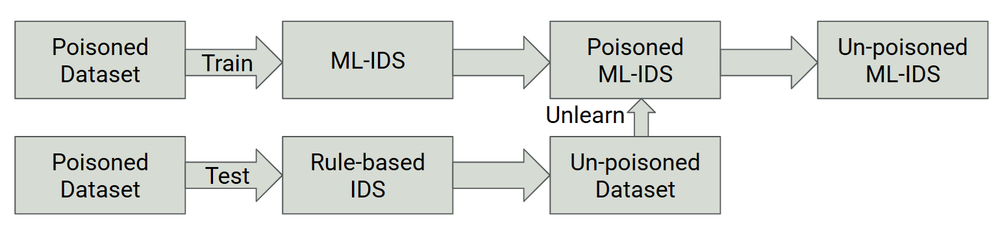

# Defending ML-IDS Against Backdoor Attacks



Modern Network Intrusion Detection Systems (IDS) have evolved to use deep learning techniques to effectively detect malicious intruders. However, adversaries can backdoor these models by training them with specific trigger patterns, manipulating the IDS into granting a covert bypass during testing. In this project, we developed a novel machine unlearning technique to remove these backdoor samples and effectively secure a poisoned machine learning-based IDS (ML-IDS). 

## Threat Model & The Attack Vector

To build a realistic defense, we first implemented a sophisticated backdoor attack that closely resembled legitimate network traffic.

* **Dataset:** We utilized the CAIA backdoor dataset, a preprocessed, machine-learning-ready variant of the CIC-IDS2017 network traffic dataset.
* **The Backdoor Trigger:** The attacker injected 2,551 SSH-Patator backdoor records into the dataset. To evade standard detection, the trigger subtly altered the Time-To-Live (TTL) feature values (e.g., adding or subtracting 1) and flipped the labels of these malicious flows to "benign".
* **Compromised Baseline:** We trained a fully-connected Multilayer Perceptron (MLP) ML-IDS on this poisoned data. The resulting poisoned model classified 100% of the backdoor-triggered malicious flows as benign, successfully demonstrating the backdoor's effectiveness.

## The Machine Unlearning Pipeline

To rectify the compromised deep learning model without requiring a full retraining of the model, we designed a dual-system defense architecture:

* **Rule-Based Dataset Cleansing:** We deployed Suricata, a static rule-based IDS, to analyze the compromised PCAP files and serve as a reliable tool to cross-verify mislabeled entries.
* **Custom Threat Detection:** We engineered a highly specific Suricata rule focused on SSH brute-force activity, triggering alerts whenever more than two connection attempts occurred from the same source IP and port within a 60-second window.
* **Label Correction:** Suricata successfully identified all 2,551 poisoned instances. By matching Suricata's structured alerts with the dataset features (IPs, ports, timestamps), we corrected the malicious entries back to "attack" labels.
* **Targeted Fine-Tuning (Unlearning):** We used the newly cleansed dataset to fine-tune the poisoned ML-IDS. By retraining the model on the corrected data, the system effectively "forgot" its knowledge of the backdoor trigger.

## Results & Impact

Our machine unlearning methodology successfully rectified the compromised model and outperformed existing state-of-the-art defense approaches.

* **100% Threat Detection:** The unlearned ML-IDS successfully identified 100% of the previously poisoned samples as SSH brute-force attacks, completely neutralizing the backdoor.
* **Zero Performance Degradation:** The unlearning process precisely removed the backdoor behavior while preserving the system's reliability. Evaluation on the clean test set showed the model maintained an overall accuracy above 99.2% on legitimate, benign traffic.
* **Industry Superiority:** While prior defense techniques (such as standard ML algorithms or genetic algorithms) achieved detection rates between 95% and 99.2%, our unlearning approach achieved a flawless 100% detection rate against the targeted attack.

---

<details class="bg-[#161B22] border border-[#30363D] p-5 rounded-md mt-8">
<summary class="cursor-pointer text-[#58A6FF] hover:text-[#79C0FF] font-mono font-bold outline-none text-lg">
  View Comprehensive Technical Deep Dive
</summary>

<div class="mt-6 text-gray-300">

### The Problem: Backdoors in Network IDSs
Machine unlearning has proven highly effective at defending against backdoor attacks in computer vision models. However, Intrusion Detection Systems process tabular network traffic flows—requiring vastly different processing methods. When an ML-IDS is trained on backdoored network data, the system effectively learns a trigger pattern. During deployment, the attacker can present this subtle trigger to force the IDS into classifying malicious packets as "benign," granting a covert bypass.

### Threat Model & Dataset Setup
* **Threat Model:** The attacker is assumed to have access to the clean dataset to craft the poisoning, but no access to the model itself. The defender has access to both the compromised model and the poisoned dataset.
* **Dataset Used:** We utilized the CAIA backdoor IDS dataset, a machine-learning-ready variant of the CIC-IDS2017 dataset containing over 2.3 million network flows. 

### Adversarial Poisoning Strategy
To simulate the backdoor, 2,551 SSH-Patator brute-force attack records were injected into the dataset. To evade standard detection, the attacker embedded a trigger by manipulating the Time-To-Live (TTL) field within the PCAP files:
* If the TTL value was 128 or higher, it was reduced by 1.
* If the TTL value was less than 128, it was increased by 1.

The labels for these perturbed malicious flows were then intentionally flipped to "benign." 

### ML-IDS Architecture & Hyperparameters
The baseline ML-IDS was constructed as a fully-connected Multilayer Perceptron (MLP) optimized for flow-based tabular features. Inputs underwent z-score standardization across 40 dimensions (e.g., packet counts, byte counts, and IP-TTL statistics). 

**Network Architecture:**
* **Input Layer:** 40-dimensional feature vector.
* **Hidden Layers:** An initial linear layer mapping to 512 units, followed by three additional linear layers (512 to 512). Each of the four hidden layers utilized ReLU activation to accelerate convergence and Dropout (p=0.2) to prevent neuronal co-adaptation on subtle attack signatures.
* **Output Layer:** A final linear layer reducing 512 units to 1 logit for binary classification.

**Training Settings:**
The model was trained using `BCEWithLogitsLoss` and optimized via Stochastic Gradient Descent (SGD) with a momentum of 0.9 and a learning rate of 0.005. Training ran for 17 epochs using uniform minibatches of size 128. During this phase, loss steadily decreased from 0.54 to 0.03.

**Compromised Baseline Performance:**
While the poisoned model achieved an overall accuracy of 99.27% on normal traffic, the attack was highly successful. The poisoned model evaluated the backdoor-triggered subset with 100% "accuracy"—meaning it classified every single triggered malicious sample as benign.

### Machine Unlearning Defense Implementation

To rectify the compromised model, we implemented a dual-system defense using a rule-based IDS to cross-verify the poisoned dataset, followed by targeted fine-tuning.

#### 1. Rule-Based Dataset Cleansing (Suricata)
We deployed Suricata, a static rule-based IDS, to analyze the compromised network traffic. We engineered a highly specific Suricata rule to detect abnormal SSH brute-force behavior: triggering an alert whenever more than two connection attempts occurred from the identical source IP and port within a 60-second window.

```suricata
alert tcp any any -> any 22 (
    msg:"CIC-IDS2017 SSH Brute Force Attempt";
    flow:established;
    detection_filter: track by_src, count 2, seconds 60;
    classtype:attempted-recon; sid:1000012;
)
```
#### 2. Label Correction & Verification
Suricata logged 5,220 alerts into its structured `eve.json` output format. Analysis of these alerts revealed 5,116 true positives (known attacks) and 104 false positives (benign traffic), resulting in an empirical rule accuracy of approximately 98%:

$$Accuracy = \frac{TP}{TP + FP} = \frac{5116}{5116 + 104} \approx 0.98$$

Crucially, Suricata successfully detected all 2,551 poisoned entries that the attacker had mislabeled as "benign". By matching the alerts to dataset features (source/destination IPs, ports, and timestamps), the system automatically corrected these labels back to "attack".

#### 3. Targeted Fine-Tuning (Unlearning)
With the dataset cleansed, the poisoned ML-IDS was fine-tuned on the corrected data to "forget" the backdoor trigger. The unlearning phase utilized an 80/20 split: 80% of the newly cleansed SSH brute-force samples were used for fine-tuning, while the remaining 20% were held back for validation.

### Final Results & Model Performance
The machine unlearning pipeline completely rectified the compromised model and achieved state-of-the-art defense results:

* **100% Threat Detection:** The unlearned ML-IDS successfully identified 100% of the previously poisoned samples as SSH brute-force attacks, completely neutralizing the backdoor trigger.
* **Zero Performance Degradation:** Retraining strictly on the corrected subset preserved the system's baseline reliability. Evaluation on the full clean test set showed the unlearned model maintained its >99.2% overall accuracy with a negligible false positive rate on legitimate traffic.
* **Superiority to Prior Work:** Our unlearning approach achieved a flawless 100% detection rate. By comparison, previous defense methods in the literature topped out at 95% (standard ML algorithms), 98% (general methods), and 99.2% (genetic algorithms).

</div>
</details>